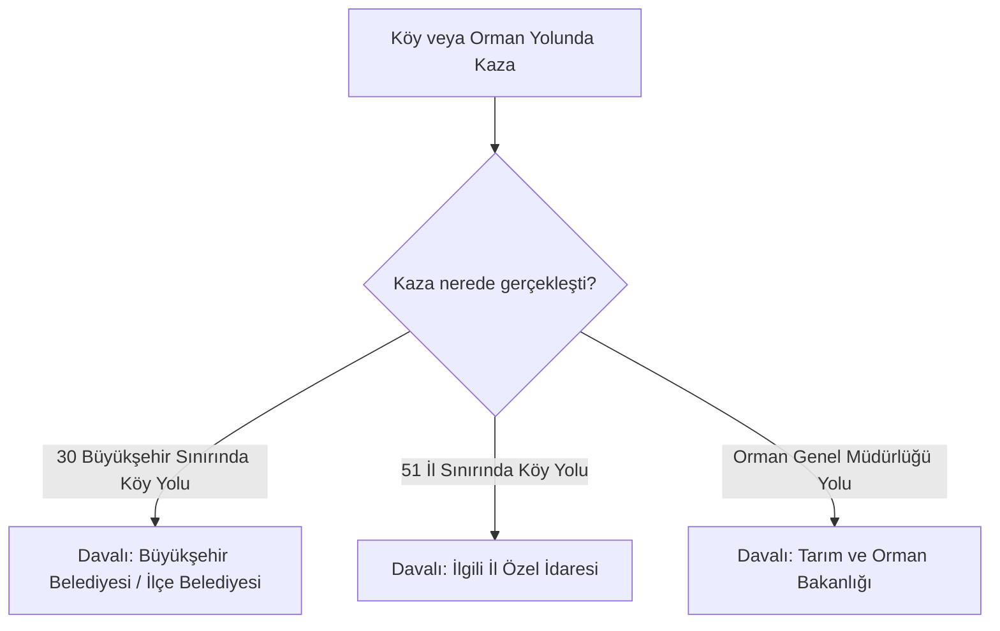

**Tarım Orman ve Köyişleri Bakanlığının görev ve yetkileri:**

---

Madde 9 – (Değişik: 18/1/1985 - KHK 245/2 md.; Aynen kabul: 28/3/1985-3176/2 md.)
Bu Kanuna göre, Tarım Orman ve Köyişleri Bakanlığının görev ve yetkileri şunlardır:
a) Orman yollarında;
1. Trafik düzeni ve güvenliği açısından anaorman yolları ile gerekli görülen diğer
orman yollarında işaretlemeler yaparak tedbirler almak ve aldırmak,
2. Bu Kanunla ve bu Kanuna göre çıkarılan yönetmeliklerle orman yolları için verilen
trafikle ilgili diğer görevleri yapmak,
b) Köy yollarında;
1. Trafik düzeni ve güvenliği açısından gerekli düzenleme ve işaretlemeleri yaparak,
tedbir almak ve aldırmak,
2. Yol güvenliğini ilgilendiren konulardaki; kavşak durak yeri, yol dışı park yeri,
aydınlatma ve benzeri tesislerin projelerini incelemek ve gerekenleri onaylamak,
3. Yapım ve bakımından sorumlu olduğu karayollarında 17 nci maddede sayılan
tesisler için bağlantıyı sağlayacak geçiş yolları yönünden izin vermek,
4. Yetkili birimlerce veya trafik zabıtasınca tespit edilen trafik kaza analizi sonucu,
karayolu yapısı ve işaretlemeye dayalı kaza nedenleri gözönünde bulundurularak gerekli tedbirleri
almak,
5. Bu Kanunla ve bu Kanuna göre çıkarılan yönetmeliklerle köy yolları için verilen
trafikle ilgili diğer görevleri yapmak.
Köy yolları için sayılan görev ve hizmetlerden zorunlu ve gerekli görülenler orman
yolları için de uygulanabilir.

---

### Akademik Yorum ve Analiz

#### 1. Maddenin Tarihsel ve İdari Teşkilat Açısından Değerlendirilmesi
Bu madde, 2918 sayılı Kanun’un karayolu ağının en taşra ve kırsal kılcal damarlarını oluşturan **"Köy ve Orman Yollarındaki Sorumluluk ve Yetki Taksimi" (Rural & Forest Roads Administration)** normudur. Kanun’un orijinal metninde bu görevler "Tarım Orman ve Köyişleri Bakanlığı"na (daha sonraki adıyla Köy Hizmetleri Genel Müdürlüğü) yüklenmiştir. 

Ancak bu madde, Türk kamu yönetimi tarihindeki en büyük desantralizasyon (yerelleşme) reformlarına sahne olmuş ve maddede geçen kurumların çok büyük bir kısmı mülga edilerek yetkileri yerel yönetimlere devredilmiştir. Bu nedenle, Madde 9’un günümüz hukuku çerçevesinde sağlıklı uygulanabilmesi için bu tarihsel idari dönüşümün analiz edilmesi şarttır.

#### 2. Yetki Devri ve Günümüz İdari Yapısındaki Sorumlular
Köy yollarının yapımı, bakımı ve trafik güvenliği konusundaki yetki ve sorumluluklar iki büyük reform dalgasıyla tamamen yerelleşmiştir:

##### A. Köy Hizmetleri Genel Müdürlüğü’nün Kaldırılması (5286 Sayılı Kanun - 2005)
2005 yılında çıkarılan **5286 sayılı Kanun** ile Köy Hizmetleri Genel Müdürlüğü lağvedilmiştir. Bu kurumun köy yollarına ilişkin tüm görev, yetki ve personeli:
*   Büyükşehir belediyesi olmayan **51 ilde**, doğrudan **İl Özel İdarelerine** (Special Provincial Administrations) devredilmiştir.

##### B. Büyükşehir Reformu (6360 Sayılı Kanun - 2012)
2012 yılında çıkarılan **6360 sayılı Kanun** ile Türkiye’deki yerel yönetim haritası radikal biçimde değişmiştir. 30 büyükşehirde İl Özel İdareleri ve "köy" tüzel kişiliği tamamen kaldırılmış, köyler mahalleye dönüştürülmüştür. Bu doğrultuda:
*   **30 Büyükşehirde:** Köy yolları artık hukuken "mahalle yolu/sokağı" statüsüne kavuşmuş ve tüm yapım, bakım ve trafik güvenliği işaretleme yetkisi **Büyükşehir Belediyelerine ve ilgili İlçe Belediyelerine** geçmiştir.
*   **51 Diğer İlde:** Köy tüzel kişiliği devam ettiği için, bu illerdeki köy yollarının sorumluluğu halen **İl Özel İdareleri** uhdesindedir.

##### C. Orman Yolları Rejimi ve Tarım ve Orman Bakanlığı (OGM)
Maddenin (a) bendinde düzenlenen "orman yolları" ormancılık faaliyetleri, yangınla mücadele ve koruma amaçlı özel statülü yollardır. Bu yolların trafik güvenliği, işaretlenmesi ve bakımı halen münhasıran **Tarım ve Orman Bakanlığı (Orman Genel Müdürlüğü - OGM)** tarafından yürütülmektedir.

#### 3. İdari Yargı Hizmet Kusuru ve Davalı Belirleme Kuralları
Köy ve orman yollarında meydana gelen yol kusurlu kazalarda (örn: köy yolunda bariyer olmaması nedeniyle uçuruma yuvarlanma, orman yolunda yetersiz uyarı işareti), açılacak tam yargı (tazminat) davalarında **"husumetin" (davalı makamın)** doğru belirlenmesi hayati önem taşır:

*   **Büyükşehir Sınırlarında:** Dava, 2577 sayılı İYUK çerçevesinde ilgili **Büyükşehir Belediyesi** nezdinde İdare Mahkemesinde açılmalıdır.
*   **Diğer İllerde:** Dava, ilgili **İl Özel İdaresi** tüzel kişiliğine karşı açılmalıdır.
*   **Orman Yollarında:** Dava, **Tarım ve Orman Bakanlığı** hasım gösterilerek açılmalıdır.

#### 4. Pratik Örnek Olaylar
**Örnek 1 (Köy Yolunda Uçuruma Yuvarlanma - İl Özel İdaresi Kusuru):**
Sivas'ın (büyükşehir olmayan il) bir köyünde yaşayan sürücü T, gece vakti keskin ve uçurumlu bir virajda bariyer (otokorkuluk) olmaması ve virajı gösteren yansıtıcı tabelaların bulunmaması nedeniyle şarampole yuvarlanmış ve eşini kaybetmiştir. T, Sivas İl Özel İdaresi'ne karşı tam yargı davası açmıştır. İdare, köy yollarında bariyer yapma bütçesi olmadığını ve köy yollarının otoyol standartlarında olamayacağını savunmuştur. İdare Mahkemesi, KTK Madde 9/b ve 5286 sayılı Kanun uyarınca, köy yollarında can ve mal güvenliğini sağlama ve işaretleme yapma görevinin İl Özel İdaresine ait olduğunu, bütçe yetersizliğinin kamusal güvenlik ödevini ortadan kaldırmayacağını belirterek idareyi tazminata mahkûm etmiştir.

**Örnek 2 (Büyükşehir Sınırlarındaki Mahalle Yolunda Kaza):**
Antalya (büyükşehir) sınırları içindeki eski bir köy, yeni adıyla mahalle yolunda yolun çökmesi sonucu bir traktör devrilmiş ve sürücü yaralanmıştır. Sürücü, Antalya Büyükşehir Belediyesi'ne karşı dava açmıştır. Belediye, buranın eski bir köy yolu olduğunu, sorumluluğun kendisinde olmadığını iddia etmiştir. Mahkeme, 6360 sayılı Kanun ve KTK Madde 9 delaletiyle, büyükşehir sınırlarında tüm köy yollarının belediye yol ağına katıldığını, dolayısıyla bakım ve güvenlik sorumluluğunun büyükşehir belediyesinde olduğunu belirterek belediyeyi hizmet kusurlu bulmuştur.

#### 5. Pratik Uygulama Notları
*   **Olay Yeri Keşfi ve Fotoğraflama:** Taşrada ve köy yollarında yaşanan kazalarda idareler genellikle kusurlarını gizlemek amacıyla hızla yol onarımı veya tabela yerleştirmesi yapmaktadır. Bu nedenle, kazadan hemen sonra olay yerinin yol yapısını, tabelasızlığını ve bariyer eksikliğini gösteren detaylı **fotoğrafların çekilmesi** veya mahkeme aracılığıyla acilen **olay yeri tespiti (delil tespiti)** yapılması dava başarısı için kritiktir.

#### 6. Eleştirel Değerlendirme
*   **Mevzuatın Güncelliğini Kaybetmesi:** KTK Madde 9 metni, halen 1985 yılındaki "Tarım Orman ve Köyişleri Bakanlığı" ibaresini korumaktadır. Köy Hizmetleri’nin kapatılmasının üzerinden 20 yılı aşkın süre geçmiş olmasına rağmen kanunun metinsel olarak güncellenmemesi, halkta ve uygulayıcılarda kafa karışıklığına yol açmaktadır. Yasa koyucunun, kanun metnini güncel idari teşkilat yapısına uyarlayarak "İl Özel İdareleri ve Belediyeler" şeklinde revize etmesi, hukuki öngörülebilirlik açısından acil bir zorunluluktur.

---

### Metodolojik Not
Bu akademik yorum ve analiz; 2918 sayılı Kanun’un 9. maddesindeki kırsal ve orman yolları rejimini, Köy Hizmetleri’nin tasfiyesi sonrası 5286 ve 6360 sayılı yerelleşme kanunlarının köy yollarındaki yetki paylaşımına etkilerini, idari yargıdaki husumet ve hizmet kusuru kurallarını **Av. Fethi Güzel**'in taşra idaresi ve belediye sorumluluk davalarındaki eşsiz saha tecrübesiyle analiz etmektedir.
