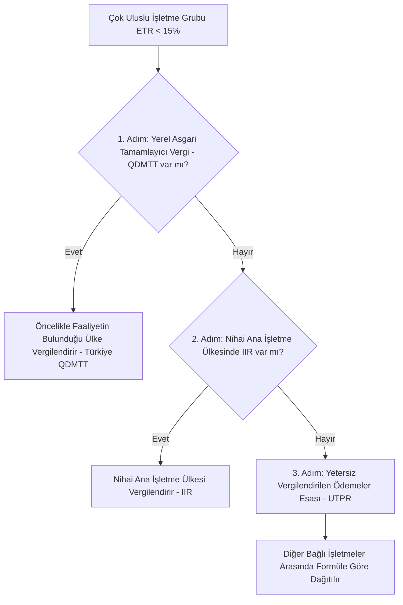

**Yürürlükten kaldırılan hükümler**

---

MADDE 36- 3/6/1949 tarihli ve 5422 sayılı Kurumlar Vergisi Kanunu ile ek ve
değişiklikleri yürürlükten kaldırılmıştır.

---

### Akademik Yorum ve Analiz

#### 1. Giriş, Tarihsel Perspektif ve Pillar 2’nin Türk Vergi Hukukuna Girişi
Küreselleşen dijital ekonominin vergilendirilmesi hususunda milletlerüstü düzeyde uzun yıllardır yürütülen müzakereler, OECD ve G20 öncülüğündeki **Matrah Aşındırması ve Kâr Aktarımı (BEPS) Kapsamlı Çerçevesi** (Inclusive Framework) kapsamında somut bir meyve vermiş ve **Pillar 2 (İkinci Sütun)** olarak adlandırılan "Küresel Asgari Kurumlar Vergisi" (GloBE - Global Anti-Base Erosion) kuralları hayat bulmuştur. 

Türkiye Cumhuriyeti, BEPS Kapsamlı Çerçevesinin kurucu üyelerinden biri olarak, egemen devletlerin vergilendirme yetkilerini uluslararası standartlarla uyumlu hale getirmeyi taahhüt etmiştir. Nitekim 28/7/2024 tarihli ve **7524 sayılı Kanun** ile Kurumlar Vergisi Kanunu’na eklenen **"BEŞİNCİ KISIM"** (Ek Madde 1 ila 13 ve Geçici Madde 17), Türk vergi hukukunda o güne kadar görülmemiş ölçüde kompleks, çok boyutlu ve uluslararası koordinasyon gerektiren yepyeni bir rejimi yürürlüğe koymuştur. 2025 ve 2026 yıllarında da bu rejimle ilgili ikincil mevzuat çalışmaları (tebliğler) hız kazanmıştır.

Bu kısmın temel felsefesi; çok uluslu işletme gruplarının (MNE), faaliyette bulundukları her bir ülkede elde ettikleri kazançlar üzerinden en az **%15 oranında** vergi ödemelerini güvence altına almaktır. Eğer bir gruptaki bağlı işletmelerin bir ülkedeki efektif vergi oranı %15’in altında kalırsa, aradaki fark "tamamlayıcı vergi" (top-up tax) olarak tahsil edilecektir.

#### 2. Kapsam ve Eşik Değerler (Ek Madde 1)
Yerel ve küresel asgari tamamlayıcı kurumlar vergisinin kapsamı son derece net kriterlere bağlanmıştır:
*   **750 Milyon Avro Sınırı:** Nihai ana işletmenin konsolide finansal tablolarındaki yıllık hasılatın, gelirin raporlandığı hesap döneminden önceki 4 hesap döneminin **en az ikisinde** 750 milyon avro (veya bu tutarın Türk lirası karşılığı) sınırını aşması gerekmektedir. 
*   **On İki Aydan Farklı Hesap Dönemi:** Kısa hesap dönemlerinde, bu hasılat yıllık bazda oranlanarak (iblağ edilerek) hesaplanır.
*   **Uluslararası Karakter:** Grubun en az iki farklı ülkede bağlı işletmeye veya iş yerine (permanent establishment) sahip olması şarttır.

Bu eşik değer, Pillar 2 kurallarının KOBİ'leri veya orta ölçekli yerel şirketleri etkilemesini engellemekte, yalnızca küresel ölçekteki dev çok uluslu yapıları hedef almaktadır.

#### 3. Temel Kavramlar ve Rejimin Aktörleri (Ek Madde 2)
Beşinci Kısım uygulamasında kullanılan kavramlar tamamen OECD Model Kuralları ile paraleldir. Kanunun sağlıklı yorumlanabilmesi için bu kavramların hukuki niteliğinin analiz edilmesi gerekir:
*   **Nihai Ana İşletme (UPE - Ultimate Parent Entity):** Başka bir işletme üzerinde doğrudan veya dolaylı olarak kontrol gücüne sahip olan, ancak kendisi üzerinde başka hiçbir işletmenin kontrol gücü bulunmayan zirvedeki kuruluştur. Kamu kurumları, varlık fonları ve kâr amacı gütmeyen kuruluşlar "nihai ana işletme" sayılsalar dahi verginin mükellefi olmaktan muaf tutulmuştur (Ek Madde 3).
*   **Bağlı İşletme (Constituent Entity):** Gruba dahil olan her bir tüzel kişilik veya ana merkeze bağlı iş yeridir.
*   **Kapsanan Vergi (Covered Taxes):** Efektif vergi oranının (ETR) hesaplanmasında pay kısmına yazılacak vergilerdir. Temel olarak gelir ve kurumlar vergisi ile benzeri nitelikteki vergileri ifade eder. Ancak nitelikli küresel veya yerel asgari tamamlayıcı kurumlar vergileri ile nitelikli olmayan iade edilebilir isnat vergileri bu kapsama girmez.

#### 4. Muafiyet ve İstisnalar (Ek Madde 3)
Egemenlik ve kamu yararı ilkeleri gereği bazı işletmeler bu vergiden tamamen muaf tutulmuştur:
1.  Kamu kurum ve kuruluşları ile uluslararası kuruluşlar,
2.  Kâr amacı gütmeyen kuruluşlar (vakıf, dernek vb.),
3.  Emeklilik yatırım fonları,
4.  Nihai ana işletme niteliğindeki yatırım fonları ve gayrimenkul yatırım araçları (GYF/GYO'lar).

**Uluslararası Deniz Taşımacılığı İstisnası (Tonnage Tax Exemption):**
Ek Madde 3’ün 5 ila 7 nci fıkralarında son derece detaylı bir "deniz taşımacılığı istisnası" öngörülmüştür. Uluslararası deniz trafiğinde işletilen gemilerden elde edilen kazançlar ve bunlarla doğrudan bağlantılı (ancak toplam kazancın %50'sini geçmeyen) yan faaliyet kazançları asgari vergi hesabından hariç tutulmuştur. Bu istisna, küresel denizcilik sektörünün kendine özgü yapısını korumak ve liman ülkelerinin rekabet gücünü muhafaza etmek amacıyla OECD kurallarına tam uyumlu olarak kaleme alınmıştır.

#### 5. Efektif Vergi Oranının (ETR) Hesaplanması (Ek Madde 4 & 5)
Efektif Vergi Oranı (EVO/ETR), çok uluslu grubun faaliyette bulunduğu her bir ülke bazında ayrı ayrı hesaplanır:

$$\text{Efektif Vergi Oranı (ETR)} = \frac{\text{Düzeltilmiş Kapsanan Vergiler Toplamı}}{\text{Net Ülkesel Bazlı Kazanç (GloBE Income)}}$$

##### A. Düzeltilmiş Kapsanan Vergiler (Ek Madde 4)
Cari dönem vergi gideri üzerinden çok ciddi düzeltmeler yapılır. Finansal muhasebede gider yazılan ancak GloBE kurallarına göre kabul edilmeyen vergiler indirilir.
*   **Ertelenmiş Vergi Düzeltmeleri:** Ertelenmiş vergi giderleri ve varlıkları asgari vergi oranı olan **%15** ile sınırlandırılarak dikkate alınır. Eğer yerel vergi oranı %20 ise, ertelenmiş vergi %15 üzerinden yeniden hesaplanır (re-casting). Ayrıca, 5 yıl boyunca ödenmeyen ertelenmiş vergi yükümlülükleri (DTA/DTL) geçmişe dönük olarak düzeltilir ve iptal edilir (recapture kuralı).
*   **Zarar Taşıma Alternatifi:** Dileyen mükellefler, karmaşık ertelenmiş vergi hesaplamaları yerine "ülkesel bazlı zarara ilişkin ertelenmiş vergi varlığı" yöntemini seçebilirler.

##### B. İşletme Bazlı Net Kazanç veya Zarar (Ek Madde 5)
Hesaplamanın paydası, UFRS/TFRS standartlarına göre hazırlanan finansal tablolardaki net kâr/zarardır. Ancak bu kâra şu düzeltmeler uygulanır:
1.  **İlave Edilecekler:** Net vergi gideri, öz sermaye zararları, emsallere uygun olmayan ilişkili kişi işlemleri düzeltmeleri, kanunen yasaklanmış fiil ödemeleri (rüşvet vb.) ve 50.000 Avro'yu aşan para cezaları.
2.  **İndirilecekler:** İstisna tutulan kâr payları (iştirak kazançları), öz sermaye kazançları, yeniden değerleme yöntemi zararları.

#### 6. Tamamlayıcı Vergi Matrahının ve Vergisinin Tespiti (Ek Madde 6)
Eğer bir ülkede hesaplanan ETR %15’in altında kalırsa, tamamlayıcı vergi oranı: 

$$\text{Tamamlayıcı Vergi Oranı} = 15\% - \text{ETR}$$

Ancak tamamlayıcı vergi, doğrudan bu oran ile net kazancın çarpılmasından ibaret değildir. Yatırımları ve istihdamı korumak amacıyla bir **"Maddi Varlık ve İstihdam İstisnası"** (Substance Carve-Out) öngörülmüştür.

##### A. Maddi Varlık ve İstihdam İstisnası (Substance Carve-Out)
Net ülkesel bazlı kazançtan şu iki tutar indirilir:
1.  **Çalışan İstisnası:** O ülkedeki bağlı işletmelerde çalışanların yıllık toplam brüt ücretlerinin **%5’i**.
2.  **Maddi Duran Varlık İstisnası:** O ülkedeki maddi duran varlıkların net defter değerinin **%5’i**.

*Geçiş Dönemi Oranları (Geçici Madde 17):* İlk yıllarda bu oranlar çok daha yüksektir. 2024 yılında çalışanlar için %9,8, maddi duran varlıklar için %7,8 ile başlar ve 10 yıllık bir süreçte kademeli olarak %5 seviyesine iner. Bu istisna, fiili (ekonomik) faaliyeti bulunan ülkelerin vergi matrahını korumakta, kâğıt üzerindeki kâr kaydırmalarını ise cezalandırmaktadır.

##### B. De Minimis (Önemsiz Tutar) İstisnası
Eğer çok uluslu grubun bir ülkedeki:
*   Yıllık ortalama hasılatı **10 Milyon Avro'dan**,
*   Yıllık ortalama kazancı **1 Milyon Avro'dan** az ise, 
grubun o ülkedeki tamamlayıcı vergisi sıfır kabul edilir (Ek Madde 6/8).

#### 7. Tamamlayıcı Vergi Mekanizmaları: QDMTT, IIR ve UTPR (Ek Madde 7, 10)
Küresel asgari vergi sistemi 3 temel sütun üzerinden tahsil edilir. Bu sütunlar arasında net bir hiyerarşi vardır:

1.  **Nitelikli Yerel Asgari Tamamlayıcı Kurumlar Vergisi (QDMTT - Qualified Domestic Minimum Top-Up Tax) (Ek Madde 10):**
    Türk kanun koyucu, egemenlik haklarını korumak amacıyla öncelikle bu vergiyi ihdas etmiştir. Eğer Türkiye'de faaliyet gösteren yabancı bir MNE'nin Türkiye'deki efektif vergi oranı %15'in altındaysa, aradaki tamamlayıcı vergiyi yabancı ana merkezin bulunduğu ülkeye (IIR vasıtasıyla) kaptırmamak için Türkiye kendisi **"Yerel Asgari Tamamlayıcı Kurumlar Vergisi"** olarak tahsil eder. Bu vergi, küresel asgari vergiden mahsup edilir ve dışarıya vergi matrahı kaçışını sıfırlar.
2.  **Gelirin Dahil Edilmesi Esası (IIR - Income Inclusion Rule) (Ek Madde 7):**
    Eğer nihai ana işletme Türkiye'de yerleşikse ve yurt dışındaki bağlı ortaklıkları gittikleri ülkede %15'ten az vergi ödüyorsa, Türkiye bu iştiraklerin eksik ödediği vergiyi Türkiye'deki ana işletmeden tahsil eder.
3.  **Yetersiz Vergilendirilen Ödemeler Esası (UTPR - Undertaxed Profits Rule) (Ek Madde 7):**
    Sistemin en son emniyet supabıdır. Eğer bir grubun düşük vergilendirilen iştiraki için ne yerel ülkede (QDMTT) ne de ana merkezde (IIR) asgari vergi uygulanmıyorsa, bu eksik vergi, gruptaki UTPR uygulayan diğer ülkelerdeki bağlı işletmelere (çalışan ve maddi varlık formülüne göre) paylaştırılarak tahsil edilir. Türkiye'de UTPR uygulaması, Geçici Madde 17/d uyarınca **1/1/2025** tarihinden itibaren geçerli kılınmıştır.

#### 8. Güvenli Limanlar ve Geçiş Dönemi Kolaylıkları (Geçici Madde 17)
Uygulama maliyetlerini azaltmak amacıyla **Geçici Madde 17** ile OECD kurallarına tam uyumlu "Geçiş Dönemi Ülke Bazlı Raporlama Güvenli Limanı" (Transitional CbCR Safe Harbor) kabul edilmiştir. 2026 yılı sonuna kadar başlayan hesap dönemlerinde, aşağıdaki 3 testten birini geçen ülkelerdeki tamamlayıcı vergi sıfır sayılır:
1.  **De Minimis Testi:** Ülke bazlı raporda toplam hasılatın 10 Milyon Avro'dan, vergi öncesi kârın ise 1 Milyon Avro'dan az olması.
2.  **Basitleştirilmiş EVO Testi:** Ülkedeki basitleştirilmiş efektif vergi oranının 2024 için %15, 2025 için %16, 2026 için %17 veya daha fazla olması.
3.  **Rutine Bağlı Kazanç Testi:** Vergi öncesi kârın, maddi varlık ve çalışan istisnası (substance carve-out) tutarından küçük veya eşit olması.

#### 9. Sistematik Değerlendirme ve Diğer Düzenlemelerle İlişki
*   **KVK Madde 32/C (Yurt İçi Asgari Kurumlar Vergisi) ile Farkı:** 
    *   *Kapsam:* Madde 32/C, 750 milyon Avro hasılat sınırına bakılmaksızın **tüm Türk kurumlar vergisi mükelleflerine** uygulanır.
    *   *Hesaplama Yöntemi:* Madde 32/C, indirim ve istisnalar düşülmeden önceki beyan kârı üzerinden %10 asgari vergi alırken; Beşinci Kısım (Pillar 2) tamamen finansal muhasebe net kazancı (TFRS/UFRS) üzerinden %15 efektif vergi hedefler.
    *   *Uygulama Alanı:* Bir grupta hem 32/C hem de Pillar 2 uygulanabilir. Öncelikle 32/C kapsamında ödenen yerel kurumlar vergisi, Pillar 2 hesabında "kapsanan vergi" (covered tax) olarak pay hanesine yazılır, böylece çifte vergilendirme önlenir.
*   **Yatırım Teşvik Belgeleri (İndirimli Kurumlar Vergisi - Madde 32/A):**
    Pillar 2 kapsamında, nakdi destekler veya "nitelikli iade edilebilir vergi kredileri" (QDTC) efektif vergi oranını düşürmezken, klasik indirimli kurumlar vergisi uygulamaları (m. 32/A) ETR'yi %15’in altına çekebilir. Bu durum, Türkiye'deki büyük ölçekli çok uluslu yatırımlarda indirimli kurumlar vergisi avantajının kısmen ortadan kalkmasına ve tamamlayıcı vergi doğmasına yol açabilir. Bu nedenle Türkiye, 2025/2026 yıllarında teşvik sistemini "nitelikli vergi kredisi" formuna dönüştürme eğilimindedir.
*   **Kamu-Özel İşbirliği (KÖİ) ve Yap-İşlet-Devret (YİD) Modelleri:**
    Madde 32 kapsamında yapılan %30'luk yüksek oranlı kurumlar vergisi düzenlemeleri, bu projeleri yürüten dev grupların Türkiye'deki ETR'sini %15'in çok üzerine çıkaracağı için bu şirketlerde Pillar 2 kapsamında ek bir tamamlayıcı vergi doğması beklenmemektedir.

#### 10. Eleştirel Hukuki Analiz
Pillar 2 düzenlemesi, klasik vergi hukuku ilkeleri olan **"verginin kanuniliği"** ve **"mali güç"** ilkelerini zorlayan unsurlar barındırmaktadır. Verginin matrahı belirlenirken yerel vergi kanunları (VUK/KVK) değil, uluslararası finansal raporlama standartları (UFRS/TFRS) esas alınmaktadır. Bu durum, muhasebe standartları kurullarının (TMSK/IASB) aldığı kararların dolaylı olarak vergi kanunlarını etkilemesi sonucunu doğurmaktadır ki bu anayasal açıdan tartışmalıdır. Ancak küresel sermaye hareketlerinin kontrolü ve vergi cennetleriyle mücadele adına bu rejim, küresel ekonominin kaçınılmaz bir gerçeğidir.

### Metodolojik Not

Bu maddedeki "Beşinci Kısım" (Pillar 2) asgari kurumlar vergisi rejimine ilişkin tüm teorik ve pratik açıklamalar, uluslararası vergi hukuku standartları ve OECD GloBE rehberleri ışığında, **Av. Fethi Güzel**'in vergi davaları ve uluslararası vergi planlaması alanındaki derin uzmanlığıyla analiz edilerek kaleme alınmıştır. Pillar 2 kapsamında doğacak uyuşmazlıklar, transfer fiyatlandırması raporlamaları ve çifte vergilendirmeyi önleme anlaşmaları (ÇVÖA) süreçleri, yüksek düzeyde metodolojik uzmanlık gerektirmektedir.
